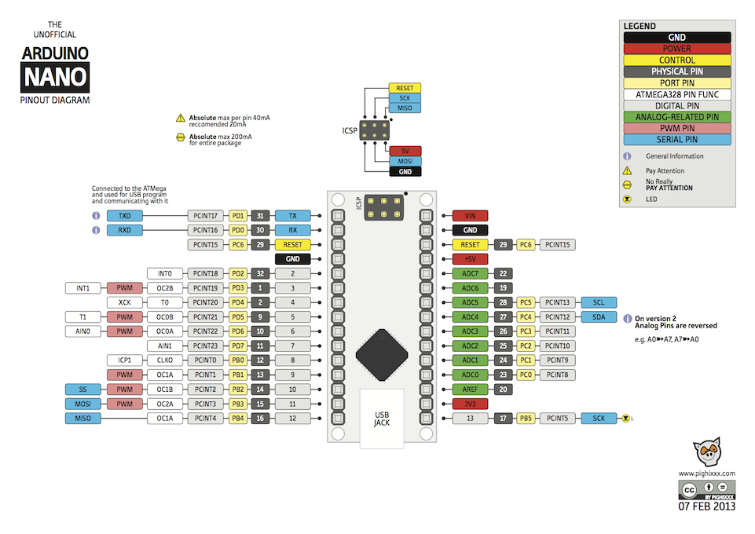

# PuertaSeccionableGarage
proyecto para sustituir microcontrolador  en una placa que controla el motor de una puerta seccionable de garaje

## Patillaje Microprocesador original.
Pin  | Uso 
------------ | -------------
1 | N.C.
2 | 5Vcc
3 | N.C.
4 | GND
5 | Módulo RF
6 | EEprom
7 | EEprom
8 | EEprom
9 | N.C.
10 | Led Estado
11 | Pulsador CL
12 | Pulsador RF
13 | Pulsador O/C
14 | GND
15 | N.C.
16 | N.C.
17 | N.C.
18 | Luz Cortesía
19 | N.C.
20 | K2 (Relé Motor)
21 | K1 (Relé Motor)
22 | N.C.
23 | Sobresfuerzo Amp. Operac.
24 | Célula Fotoeléctrica
25 | Resistencia 10k a GND ?
26 | Xtal 1
27 | Xtal 2
28 | ?

## Conversión de patillaje original a Patillaje del Arduino Nano.

Arduino Nano| Micro Original | Uso
----------- |-------------- | -----------
Denominación | Pin | Descripción
D2           |  5  | Módulo R.F.
D3           |  10 | Led
D4           | 11  | Pulsador CL
D5           | 12  | Pulsador RF
D6           | 13  | Pulsador O/C
D7           | 18  | Luz Cortesía
D8           | 20  | K2
D9           | 21  | K1
A0           | 23  | Sobresfuerzo Amp. Operac.
A1           | 24  | Céllula Fotoeléctrica

## Patillaje del Arduino Nano

